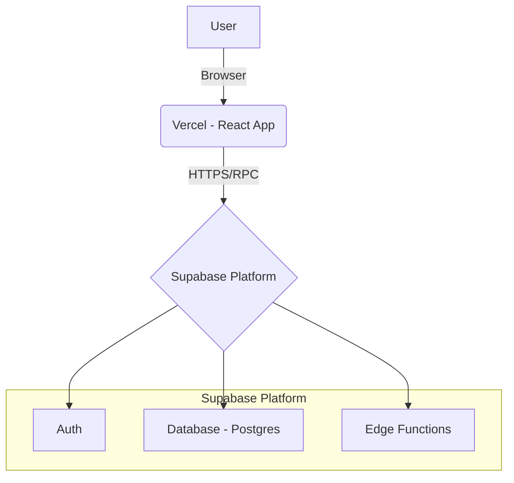

### **เอกสาร: Fullstack Architecture Document**
### **โครงการ: Logistics CRM (MVP)**

---

### **1. Introduction (บทนำ)**
เอกสารนี้สรุปสถาปัตยกรรมแบบ Fullstack ทั้งหมดสำหรับโปรเจกต์ Logistics CRM MVP ซึ่งครอบคลุมทั้งระบบ Backend, Frontend, และการเชื่อมต่อระหว่างกัน โดยจะใช้เป็นเอกสารอ้างอิงหลักเพียงฉบับเดียวสำหรับทีมพัฒนา เพื่อให้การทำงานเป็นไปในทิศทางเดียวกัน

**Starter Template or Existing Project (เทมเพลตเริ่มต้น):**
- Frontend: **Vite + React template**
- Backend: ปฏิบัติตาม Guideline ของ **Supabase** สำหรับการตั้งค่าเริ่มต้น

**Change Log (ประวัติการแก้ไข):**
| วันที่ | เวอร์ชัน | รายละเอียด | ผู้จัดทำ |
| :--- | :--- | :--- | :--- |
| 30/08/2025 | 1.0 | จัดทำเอกสารฉบับร่างแรก | Winston (Architect) |

---

### **2. High Level Architecture (สถาปัตยกรรมภาพรวม)**

#### **2.1 Technical Summary (สรุปทางเทคนิค)**
สถาปัตยกรรมของโปรเจกต์นี้จะเป็นแบบ **Serverless เต็มรูปแบบ** โดยใช้ **React (Vite)** สำหรับ Frontend และ **Supabase** เป็น Backend-as-a-Service (BaaS) ซึ่งจัดการทั้งฐานข้อมูล (PostgreSQL), ระบบยืนยันตัวตน (Auth), และ Serverless Functions โค้ดทั้งหมดจะถูกเก็บใน **Monorepo** และ **deploy ผ่าน Vercel**

#### **2.2 Platform and Infrastructure Choice (แพลตฟอร์มและโครงสร้างพื้นฐาน)**
- **Platform:** Supabase
- **Key Services:** Supabase Auth, Database (PostgreSQL), Edge Functions
- **Deployment Host:** Vercel (สำหรับ Frontend)

#### **2.3 Repository Structure (โครงสร้างที่เก็บโค้ด)**
- **Structure:** Monorepo
- **Monorepo Tool:** npm workspaces
- **Package Organization:**
  - `apps/web` → React App
  - `packages/shared` → Types และ shared logic
  - `supabase` → Database migrations & functions

#### **2.4 High Level Architecture Diagram (แผนผังภาพรวม)**


#### **2.5 Architectural Patterns (รูปแบบสถาปัตยกรรม)**
- **Serverless Architecture / JAMstack** → ใช้ Supabase + Vercel
- **Component-Based UI** → สร้าง UI ด้วย React + shadcn/ui
- **Backend as a Service (BaaS)** → เร่งการพัฒนาโดยใช้ฟีเจอร์สำเร็จรูปจาก Supabase

---

### **3. Tech Stack**

| Category             | Technology             | Version | Purpose                          | Rationale                                   |
| -------------------- | --------------------- | ------- | -------------------------------- | ------------------------------------------- |
| Frontend Language    | TypeScript            | ~5.x    | พัฒนา Frontend                 | เพิ่มความแม่นยำ ลดข้อผิดพลาด            |
| Frontend Framework   | React                | ~18.x   | สร้าง UI                       | เป็นที่นิยม มี Ecosystem ดี               |
| UI Component Lib    | shadcn/ui             | latest  | คลัง Component สำเร็จรูป       | สวยงาม ปรับแต่งง่าย                      |
| State Management     | React Context API    | built-in| จัดการ State                    | มาพร้อม React เหมาะกับ MVP               |
| Backend Language     | TypeScript           | ~5.x    | Edge Functions                  | ใช้ภาษาเดียวกับ Frontend                  |
| Backend Framework    | Supabase Edge Funcs  | latest  | Business Logic                  | Integrated กับ Supabase                   |
| API Style            | PostgREST            | built-in| CRUD API                        | Supabase สร้างให้โดยอัตโนมัติ            |
| Database             | PostgreSQL           | 15.x    | ฐานข้อมูลหลัก                  | ทรงพลัง มาพร้อม Supabase                 |
| Authentication       | Supabase Auth        | built-in| ระบบยืนยันตัวตน                | จัดการ User ได้ง่าย                       |
| Frontend Testing     | Vitest + RTL         | latest  | Unit & Integration Test         | เหมาะกับ React + Vite                     |
| Build Tool           | Vite                 | ~5.x    | Build โปรเจกต์                 | เร็วทันสมัย                                |
| IaC Tool             | Supabase CLI         | latest  | Database Migrations             | เครื่องมือทางการ Supabase                 |
| CI/CD                | GitHub Actions       | latest  | Deploy อัตโนมัติ               | ฟรีและมาตรฐาน                             |
| CSS Framework        | Tailwind CSS         | ~3.x    | Styling                         | ใช้ร่วมกับ shadcn/ui                       |

---

### **4. Data Models (โมเดลข้อมูล)**

#### **Customer (ลูกค้า)**
```ts
export interface Customer {
  id: string;
  created_at: string;
  name: string;
  email: string;
  phone: string;
}
```

#### **Job (รายการงาน)**
```ts
export interface Job {
  id: string;
  created_at: string;
  customer_id: string;
  description: string;
  status: 'New' | 'In Progress' | 'Done';
  customers?: Customer;
}
```

---

### **5. API Specification (ข้อกำหนด API)**
- ใช้ **Auto-generated REST API ของ Supabase**
- เรียกใช้งานผ่าน **Supabase Client Library**
- จัดการ Auth, Security และ CRUD อัตโนมัติ

---

### **6. Database Schema (โครงสร้างฐานข้อมูล)**
```sql
-- Table for Customers
CREATE TABLE public.customers (
  id UUID DEFAULT gen_random_uuid() PRIMARY KEY,
  created_at TIMESTAMP WITH TIME ZONE DEFAULT timezone('utc'::text, now()) NOT NULL,
  name TEXT NOT NULL,
  email TEXT,
  phone TEXT
);

-- Table for Jobs
CREATE TABLE public.jobs (
  id UUID DEFAULT gen_random_uuid() PRIMARY KEY,
  created_at TIMESTAMP WITH TIME ZONE DEFAULT timezone('utc'::text, now()) NOT NULL,
  customer_id UUID REFERENCES public.customers(id) ON DELETE CASCADE,
  description TEXT NOT NULL,
  status TEXT DEFAULT 'New'::text NOT NULL
);
```

---

### **7. Unified Project Structure (โครงสร้างโปรเจกต์)**
```
/logistics-crm-mvp
├── apps/
│   └── web/
│       ├── src/
│       │   ├── components/
│       │   ├── pages/
│       │   └── services/
│       ├── public/
│       ├── package.json
│       └── vite.config.ts
├── packages/
│   └── shared/
│       ├── types.ts
│       └── package.json
└── package.json
```

---

### **8. Development Workflow (ขั้นตอนการพัฒนา)**
1. **ติดตั้ง Dependencies:** `npm install`
2. **ตั้งค่า Environment:** สร้าง `.env` และใส่ Supabase URL + Anon Key
3. **รัน Development Server:** `npm run dev --workspace=web`

---

### **9. Deployment Architecture (สถาปัตยกรรมสำหรับการ Deploy)**
- **Frontend:** Deploy ผ่าน **Vercel** (เชื่อม GitHub repo)
- **Backend:** จัดการโดย Supabase, deploy schema changes ผ่าน **Supabase CLI**

---

### **10. Coding Standards (มาตรฐานการเขียนโค้ด)**
- **Data Access:** ต้องใช้ Supabase Client Library
- **Type Sharing:** Type ทั้งหมดอยู่ใน `packages/shared`
- **Environment Variables:** เรียกใช้ค่าผ่าน `import.meta.env.VITE_*`

---

