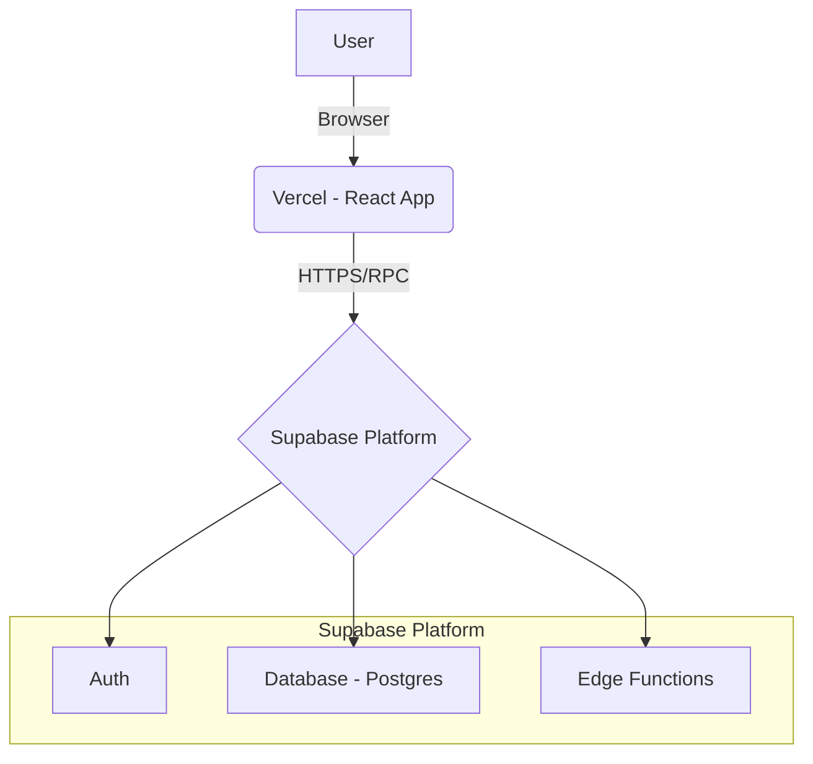

# **2. High Level Architecture (สถาปัตยกรรมภาพรวม)**

### **2.1 Technical Summary (สรุปทางเทคนิค)**
สถาปัตยกรรมของโปรเจกต์นี้จะเป็นแบบ **Serverless เต็มรูปแบบ** โดยใช้ **React (Vite)** สำหรับ Frontend และ **Supabase** เป็น Backend-as-a-Service (BaaS) ซึ่งจัดการทั้งฐานข้อมูล (PostgreSQL), ระบบยืนยันตัวตน (Auth), และ Serverless Functions โค้ดทั้งหมดจะถูกเก็บใน **Monorepo** และ **deploy ผ่าน Vercel**

### **2.2 Platform and Infrastructure Choice (แพลตฟอร์มและโครงสร้างพื้นฐาน)**
- **Platform:** Supabase
- **Key Services:** Supabase Auth, Database (PostgreSQL), Edge Functions
- **Deployment Host:** Vercel (สำหรับ Frontend)

### **2.3 Repository Structure (โครงสร้างที่เก็บโค้ด)**
- **Structure:** Monorepo
- **Monorepo Tool:** npm workspaces
- **Package Organization:**
  - `apps/web` → React App
  - `packages/shared` → Types และ shared logic
  - `supabase` → Database migrations & functions

### **2.4 High Level Architecture Diagram (แผนผังภาพรวม)**

### **2.5 Architectural Patterns (รูปแบบสถาปัตยกรรม)**
- **Serverless Architecture / JAMstack** → ใช้ Supabase + Vercel
- **Component-Based UI** → สร้าง UI ด้วย React + shadcn/ui
- **Backend as a Service (BaaS)** → เร่งการพัฒนาโดยใช้ฟีเจอร์สำเร็จรูปจาก Supabase

---
